# Developers Guide to Velero (Mac OSX version)

One of the things I find frustrating when starting a new project is struggling to get the development environment setup correctly.  For the past 4-5 months I've been working with the Office of the CTO at VMware on developing plugins in the Go programming language for project Velero.  Velero (velero.io) is an open source project designed to backup and migrate Kubernetes resources and persistent volumes.  With that in mind, here's a handy guide to getting started developing with Velero.  

This guide walks you through required tools and configurations that are needed from a developers standpoint.  This guide makes some assumptions on tools (Docker, Dockerhub, AWS, Mac OSX).  You are free to swap in the tools of your choosing.

# Install Prerequisite tools and Configuration

## Tool versions used in creating this document
- Docker 19.03.12
- KIND 0.8.1
- Kubectl 1.18.2
- Mac OSX 10.15.6
- Velero 1.5

## Install and/or make sure docker desktop is running on the Mac
- Install docker desktop if needed

  - https://www.docker.com/products/docker-desktop
- Open a terminal session on the mac

  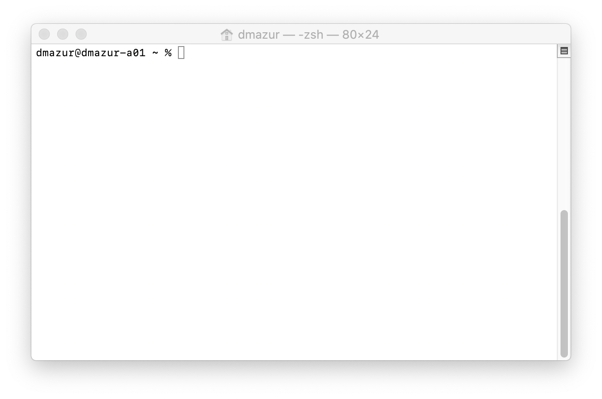

- % Docker --version

  Docker version 19.03.12, build 48a66213fe

- How to check for updates and restart

  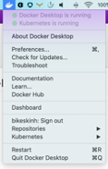

- Go into "Preferences-> Command Line" and enable experimental features
  - This enables "docker buildx" which is experimental in Docker 19.03  but required to build a velero container image later.
  - https://docs.docker.com/buildx/working-with-buildx/
  - Select "Apply & Restart" docker

     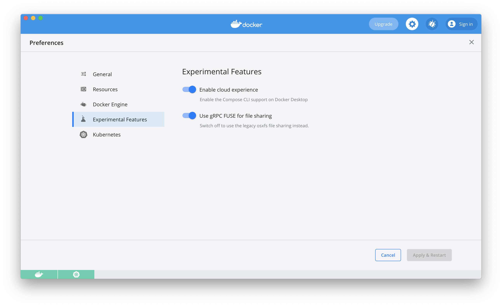

- Where to get more information
  - https://www.docker.com/products/docker-desktop

## Install and/or test the Velero client on the Mac
- In the terminal session
- % Brew install velero
  - Make sure "brew" is installed first
  - https://docs.brew.sh/Installation
- % velero version

    
    Client:
        
        Version: v1.5.0

        Git commit: -
    Server:
        
        Version v1.5.0

- Brew installs the Velero client at
  - /usr/local/Cellar/velero/1.5.0/bin/velero
  - and creates a symlink at:
  - /usr/local/bin/velero
  - Why is this useful?  If you build a new version of the Velero client and want to replace it later

## Setup a Github account
- https://docs.github.com/en/github/getting-started-with-github/set-up-git
  - Follow the steps for installing the client and setting up username, commit email and credentials
- You will be using github from the terminal session
- Install the github client
  - % brew install git
  - % git version
    
      
      git version 2.24.1 (Apple Git-126)

## Setup a Dockerhub image registry account
- https://docs.docker.com/docker-hub/
- You will use this to push/pull container images from the registry
- In the terminal session

  - % docker login username=yourhubusername email=youremail
  - Using your dockerhub username/password
- You can also use Quay, Harbor or other image registry

## Setup an AWS account with an S3 bucket
- The AWS S3 bucket will be used to store the Velero backup
- Setup Free AWS account
- Under Services->Storage->S3

  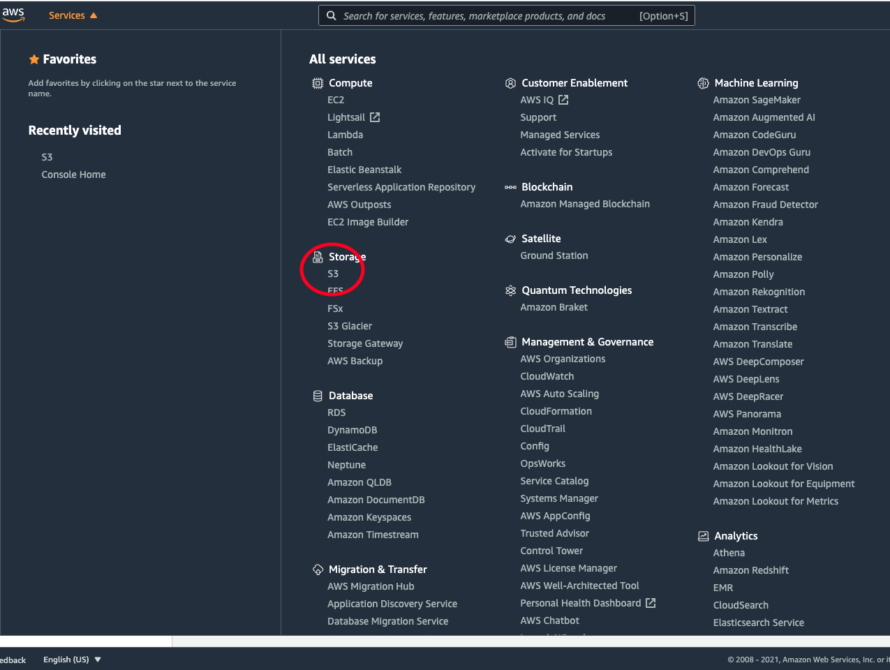

- Create a bucket which will store the velero backup

  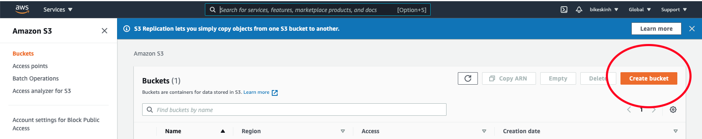

- In a terminal session on the mac, install the aws cmd line tool
  - % brew install awscli
  - % aws help
- Next, setup aws credentials
  - This is used to make programmatic calls to aws from the aws cli

  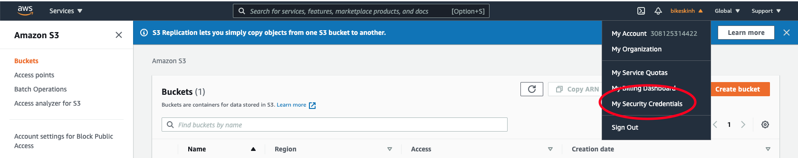

- Select "My Security Credentials"
- Under "Access Keys" select "Create New Access Key"

- Select "Download Key File" and save in a secure location on your Mac as <name>.csv
- Next use the access key to connect the aws cli on your mac to your aws account
  - % aws configure

    AWS Accerss Key ID [***********EXDF]:

    AWS Secret Access Key [***********exdf]:

    Default region name [use-east-1]:

    Default output format [text]:

  - Enter your access key id and secret access key from the .csv key file
  - Select your aws region
  - Enter "text" as the default output format
- Test the aws connection
  - % aws s3 ls
  - You should see the S3 bucket you created:

    2020-07-28 09:30:20 test-velero-migration

- [Note]  You can use another approved cloud provider besides AWS (i.e. Google Cloud, Microsoft Azure, etc)]
- In your terminal session, go to your home dir and check for the .aws directory and credentials file
  - % cd ~
  - % ls -al
    
    total 52
    ...
    drwxr-xr-x   4  user  group 128 Sept 9  14:43 .aws

## Install JSON helper utility "jq" on the Mac
- % brew install jq
- https://formulae.brew.sh/formula/jq
- This will be helpful for viewing Velero JSON files

## Install KIND ( a kinda Kubernetes version) on the Mac
- Feel free to use your own Kubernetes cluster.  This suggests KIND due to simplicity.
- You will create a Kubernetes cluster using KIND and back it up using Velero (later)
- https://kind.sigs.k8s.io/docs/user/quick-start/
- % brew install kind
- % kind version
  kind v0.8.1 go1.14.4 darwin/amd64

- Create a cluster for testing the Velero backup
  - % kind create cluster --name=velero-dev
- Check to make sure the cluster exists
  - % kind get clusters
    velero-dev

# Alright!  You've made it this far!  Let's get started with Velero!!!

## Install the Velero backup controller in the cluster
- Setup environment variables for AWS
- Run the velero install command

  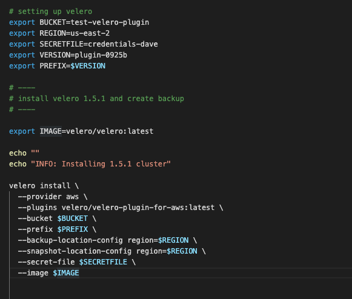

## Backup your cluster to AWS using Velero

- In a terminal session on the mac:
- % velero backup create your-backup-name
- This command submits a backup request to the Velero backup controller that you installed in the cluster earlier
- The controller listens for requests and starts the backup when it sees a request
- Check to see if the backup completed

  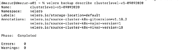

- You can also go into your AWS S3 bucket and see the backup

  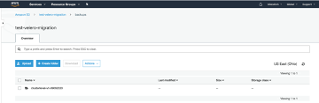

## Delete your cluster (Yes, really delete your Kind cluster!)
- % kind delete cluster --name=velero-dev
- % kind get clusters
  - Velero-dev should be outta here!

## Restore your cluster from the Velero backup stored in AWS
- Create an empty cluster
  - % kind create cluster --name=velero-dev
- Install the Velero backup controller image in the cluster
  - % velero install .
- Restore the cluster contents from backup
  - % velero restore create --from-backup <xxxx>
- % kind get clusters

# Now let's GO dig into the development

## Velero plugins and code are developed in Go Lang
- Install Go Lang
- https://golang.org/doc/install

## Grab the Velero source code
- % git clone https://github.com/vmware-tanzu/velero.git

## Compile and build the Velero client code (Darwin/AMD64)
- cd ~/go/src/velero
- % make local
- This creates a velero executable in the current directory
- Replace the installed version 
  - % sudo mv ./velero /usr/local/bin/velero
- When you run the velero command line, you should now be using your version of the velero client

## Compile and build the Velero binary targeting linux/amd64 within a build container on your local machine
- cd ~/go/src/velero
- % make

## Build the Velero container image
- % make container
- You should see something like this.
  Client:
  
      Version: v1.5.0
      Git commit: -

  Server:
      Version: v1.5.0

- Make sure the image has been built
- % docker image ls

  REPOSITORY      TAG     IMAGE ID      CREATED             SIZE
  
  
  velero/velero   main    f67a3a888feb  About a minute ago  15.3MB

## Push the new Velero image to your Dockerhub registry
- First, go into docker hub and create a repository for the image

  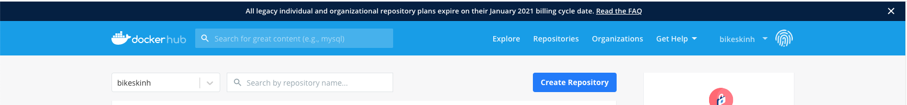

- Create a tag using the image id from docker image ls
- % docker tag image-id dockerhub-id image-name:version
- % docker tag f67d7a9378bd <dockerhubid>/velero:v1
- Now, push the tagged image to docker hub
- % docker push <dockerhubid>/velero
- Go into docker hub and check that the tag has been pushed

## Use your new Velero image in place of the original Velero image you installed in the KIND cluster earlier

In this example, velero install adds the "--image" flag which uses the tagged image in dockerhub and uses your aws credentials to configure the backup controller

  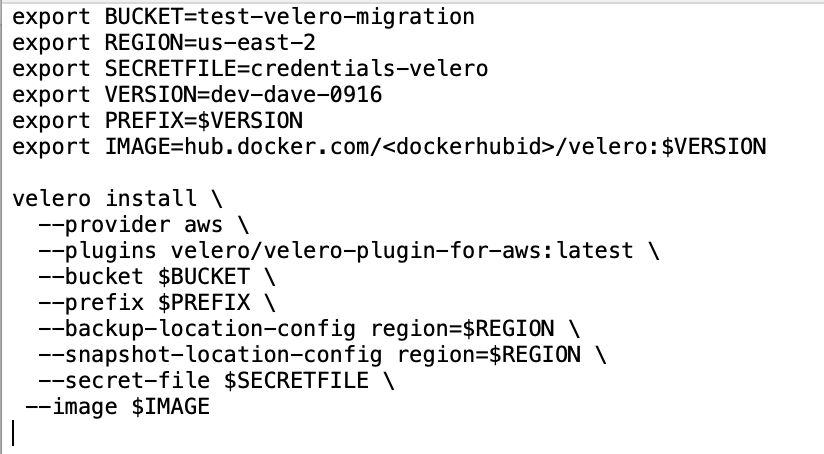

Hopefully, this gets you started!

Head over to github.com for the markdown version of this document and also for sample scripts to help you install and run velero.

https://github.com/davemazur/velero_dev_guide

Next:  Using Min.io as the Velero object store in place of AWS S3

