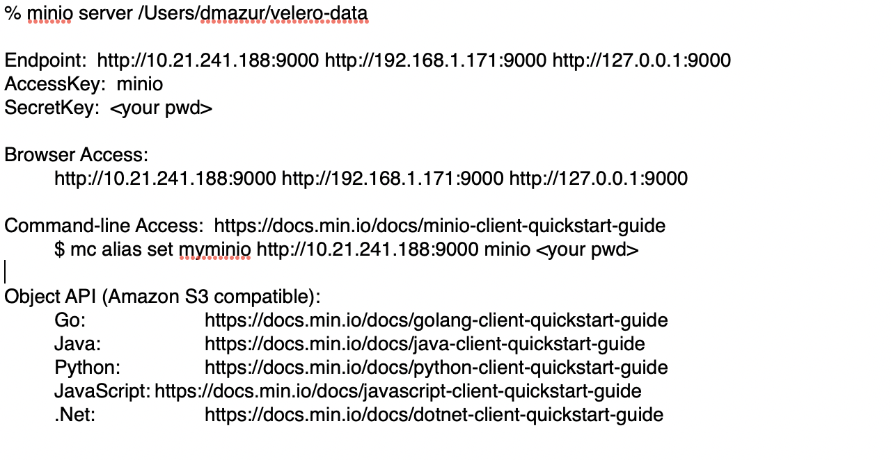
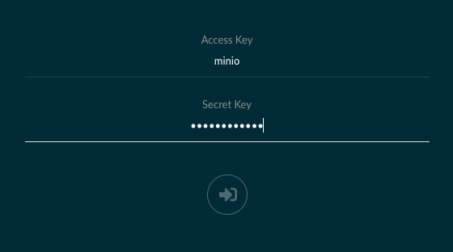
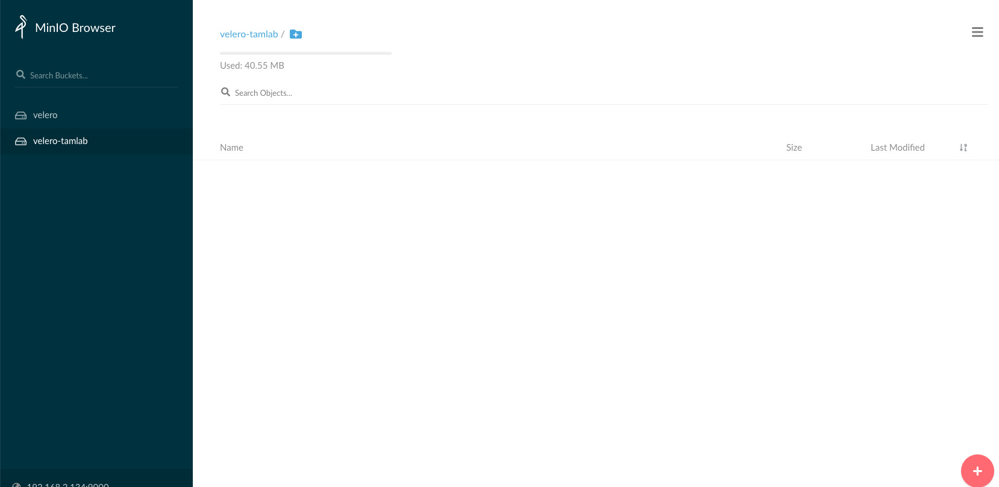
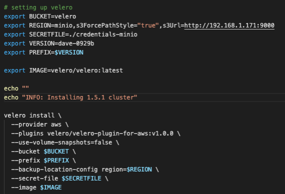

# Run Velero with Min.io as the cloud provider

    Emulate the AWS endpoint by using Minio object storage to persistently store the backups in a local directory on your Mac

During development and testing of a plugin for Velero, I blew through my monthly AWS “allowance” in a little over two weeks.  When I thought about it, I had a few options to pursue.  I could wait until the end of the billing cycle to refresh my funds, get approval for a larger allowance (not happening!), or figure out another option for a cloud provider.

I started thinking about object stores and persistent volumes and had a conversation with Rafael Brito (http://www.rafaelbrito.com/).  He pointed me to a blog he did back in 2019 using Minio + NFS (http://www.rafaelbrito.com/2019/11/project-velero-12-on-openshift-311.html).

I did some research into Minio (https://min.io/) and realized there was a simple way to use Minio + a local directory on the Mac to mimic using AWS as a cloud provider for Velero backup and restore.

I thought others might find these steps useful during dev/test so here goes…
    

## Get the Minio server up and running first

**Install the Minio server on the Mac**

     % brew install minio/stable/minio

**Create a directory on the mac to use as the local persistent storage:**

     % cd /Users/<your username>

     % mkdir velero-storage

**Start up the Minio server on the mac and pass the newly created directory to Minio**

     % export MINIO_ACCESS_KEY=minio

     % export MINIO_SECRET_KEY=<your minio pwd>

     % minio server /Users/<your username>/velero-storage

     

**Open a browser and access the Minio interface via one of the endpoints:**

**You must first create the bucket in Minio before using Velero backup**

	     Go into the Minio gui and select the (+) button in the lower right hand corner and create a "velero" bucket manually

**Next, go into your home directory and create a credentials-minio file.  This is similar to your .aws/credentials file**

     % more credentials-minio
     [default]
     aws_access_key_id = minio
     aws_secret_access_key = <your minio pwd>

**Then setup the environment variables and install Velero to use Minio**

    There are a couple items of note:

    BUCKET is the bucket you created in Minio

    REGION uses the url of the Minio server

    SECRETFILE points to your credentials file

    use-volume-snapshots must be false

**Then run your Velero backup**

     % velero backup create velero-test

**Once the backup completes, you should see the backup stored in your velero-storage directory on the Mac and also in the velero bucket in the Minio browser gui!**
